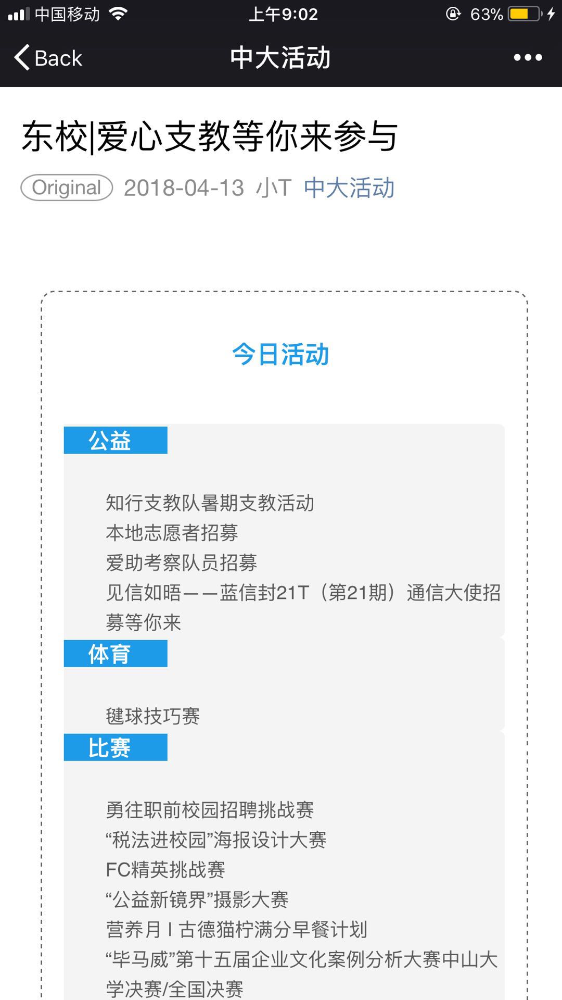

## 产品特性xuqiu

1. 无须安装，随时可以使用"中大活动"了解四大校区的活动信息。

   使用微信小程序，无须用户特意下载安装App。在几乎人人手机都安装了有微信的今天，只要用户有需要，随时随地可以从微信里找到这款小程序，了解近日的校园活动并报名参加。小程序里搜索“中大活动”即可使用。

2. 简洁美观的手机UI界面

   

   

3. 活动性质分类，易于用于查找使用

   

   

4. 输入活动核心信息，即可发布活动

   作为活动的发起人，只需关注填写活动的核心信息--活动名称、地点和时间，并加上一小段的活动简介。即可自动生成微信推文并按格式排版，推送到中大活动公众号和“中大活动”小程序中。

   

   

   

   ​