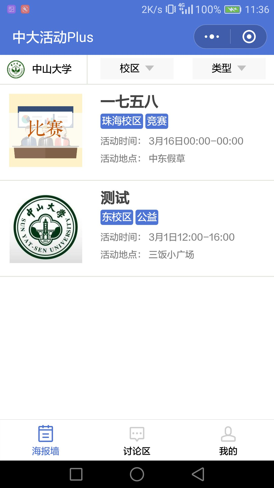
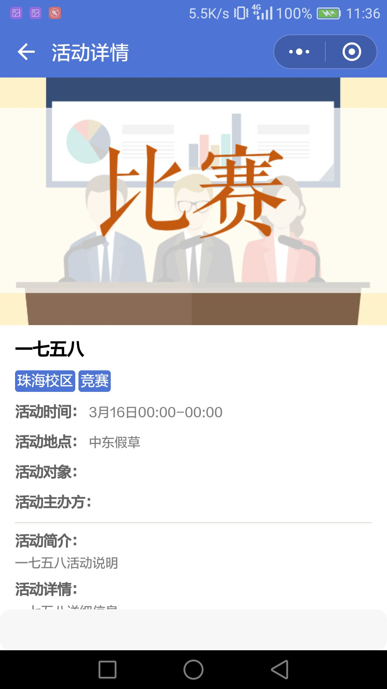
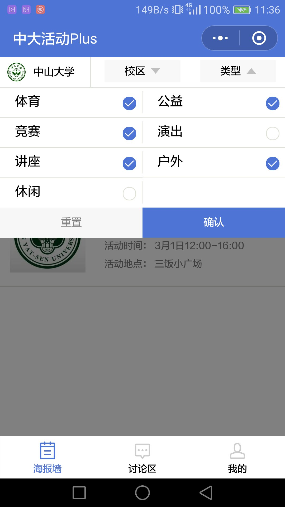
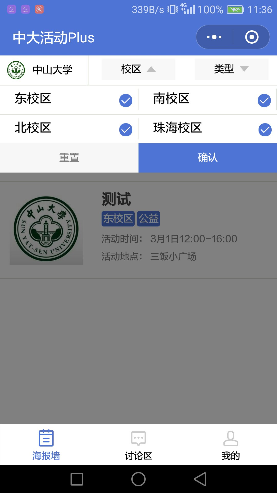
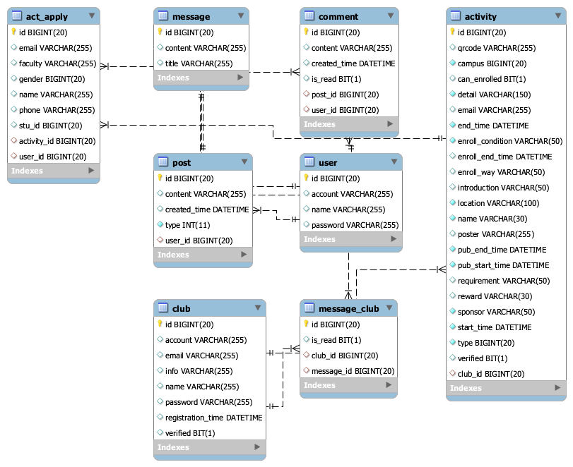

# 第一次迭代总结会议

## 1. 成果展示

### 1.1 最终产品展示（修改后）

### 1.2 过程产出

#### 1.2.1 功能架构图

#### 1.2.2 软件需求说明书
[软件需求说明书](https://github.com/sysu-SAAD-project/Document/blob/master/iter-1/%E8%BD%AF%E4%BB%B6%E9%9C%80%E6%B1%82%E8%AF%B4%E6%98%8E%E4%B9%A6.md)

#### 1.2.3 api接口设计与实现
HOST: https://www.sysuactivity.com

- List required activities [GET /act?page={pageNum}]
- Get detailed activity information [GET /act/{id}]

#### 1.2.4 数据库设计

### 1.3 测试反馈
[小程序1.0测试反馈](https://shimo.im/docs/JeOeEFIl6eA4wgCK)

## 2. 第二次迭代说明

### 2.1 产品功能
- 完成小程序端的三大主要功能之一：“我的”。实现用户登录权限和用户信息展示

### 2.2 完善测试流程
- 前端配置eslint检查代码风格，并使用travis CI集成
