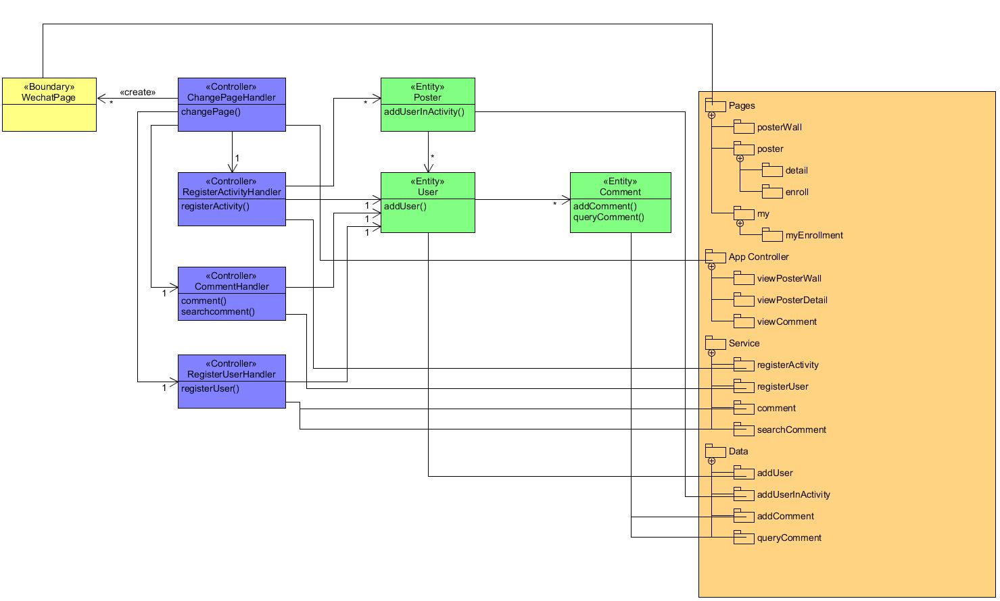

# Activity+软件项目开发规范

## 工作流

### 概述

采用gitlab工作流，master为主分支，所有的开发工作均在master分支进行，完成开发后，于每次迭代最后两天，将代码进行集成测试，完成后，从master分支拉取代码，合并至production分支

### 权限

各方向组长有各自仓库的全部权限，组员只有对master分支进行修改的权限，对其他项目和分支，拥有查看的权限

### git仓库使用要求

**必须遵循commit-pull-push的过程**否则由此带来的任何代码遗失等问题，由本人承担

## 代码规范

### 前端要求

使用eslint对代码进行规范，每次提交前，必须先保证静态测试通过，除此之外，代码中需包含必要的注释，包括但不限于以下内容：

- 每个实际函数前的输入、输出及函数功能阐述
- 类(如果存在)的具体说明及成员变量说明

### 后台要求

使用gofmt或vscode插件对代码进行格式化，不再要求单独的静态测试，注释的要求请参阅上述前端要求

## 任务发布

所有的要求均在github的team模块下进行发布，每次迭代的任务均在Kanban上进行发布，请注意，每次发布的任务的完成时间，都应在每个开发迭代周期结束的两天前完成，未被完成的内容，不得标记为已完成。

## REST API设计规范

本产品前后端交流均使用rest api进行，以下内容为对api进行的限制(当前的api沿用已有api，之后的重构会遵循此风格)：

1. 资源名必须是合法的C语言变量名
1. 资源集合必须是复数
1. 不要用缩写避免不必要的歧义
1. 不要用过于泛化的资源类型
1. 每个 HTTP 方法和以对应不同的语义
1. 使用GET方法获得资源列表，使用POST进行增添，使用PUT进行资源更新
1. URL路径可以定位唯一资源

## 逻辑架构到应用程序映射指南(TODO: wzj)by wzj 15331309

## 物理架构云上部署 dock-compose.yml 文件编写与使用(TODO: txz, xxzh)

本项目包含PC和小程序两部分，均使用同一docker-compose文件，该文件定义了一下内容：

1. 镜像名
1. 归属网络
1. 容器参数(使用环境变量提供)
1. 端口开放

其中，镜像是最基础的部分，需要相互沟通的容器之间处于同一个网络，利用容器名直接访问；系统后台运行在容器内部，不直接对外暴露端口，而是由最外层的nginx统一代理，提供外界接口访问。

为方便使用，提供了一个shell文件，集中了所有的需要操作，部署时只需要运行该shell文件即可一键完成更新和安装
