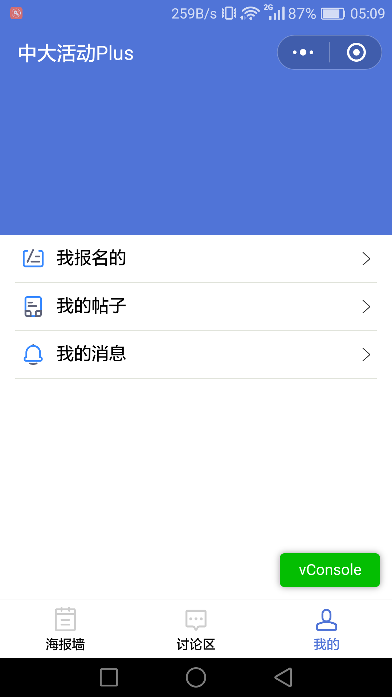
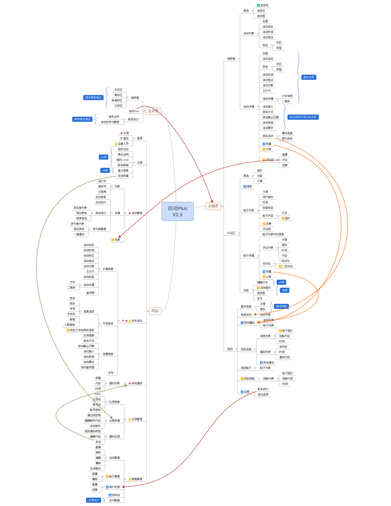
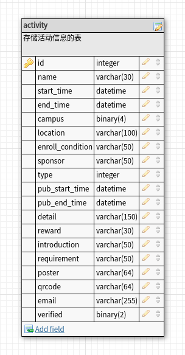

# 第一次迭代总结会议

## 1. 成果展示

### 1.1 最终产品展示
- 个人页面

- 前端配置eslint检查代码风格，并使用travis CI集成

### 1.2 过程产出

#### 1.2.1 功能架构图

#### 1.2.2 软件需求说明书
[软件需求说明书](https://github.com/sysu-SAAD-project/Document/blob/master/iter-2/%E7%94%A8%E6%88%B7%E9%A1%B5%E9%9D%A2%E9%9C%80%E6%B1%82.md)

#### 1.2.3 api接口设计与实现
HOST: https://www.sysuactivity.com

- User Collection [POST /users]

#### 1.2.4 数据库设计

## 2. 第三次迭代说明

### 2.1 产品功能
- 完成活动报名功能
