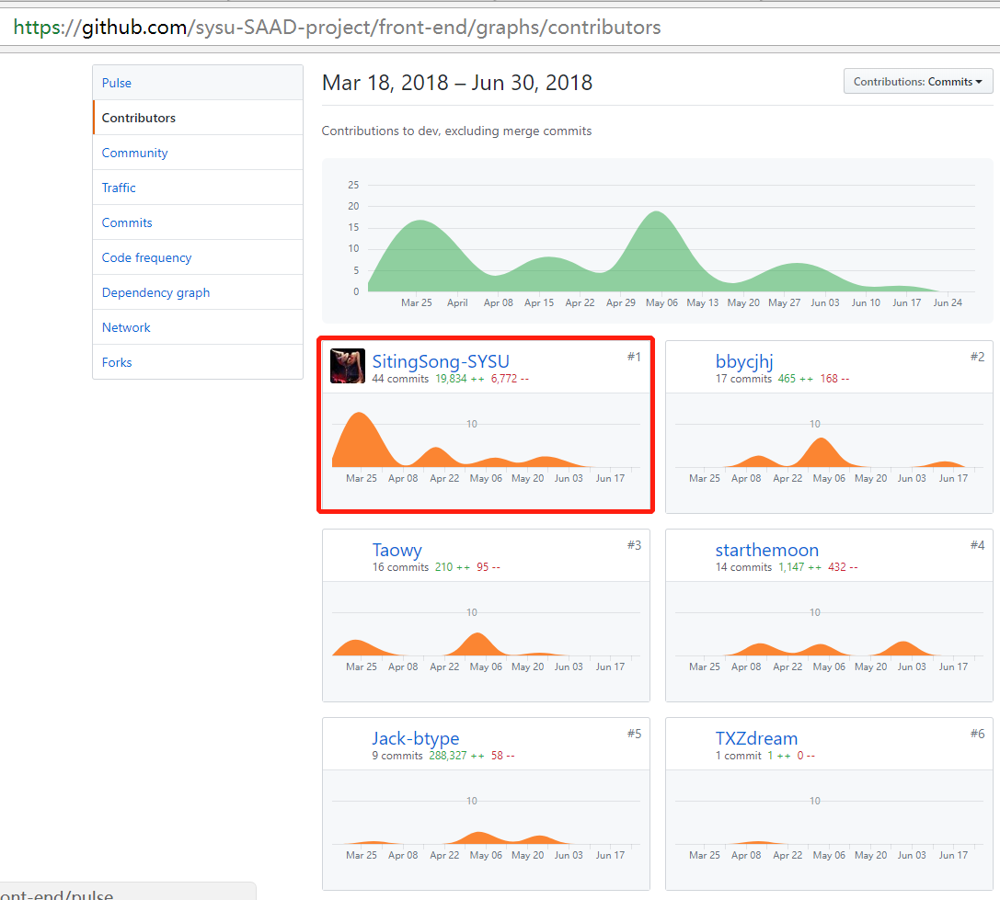
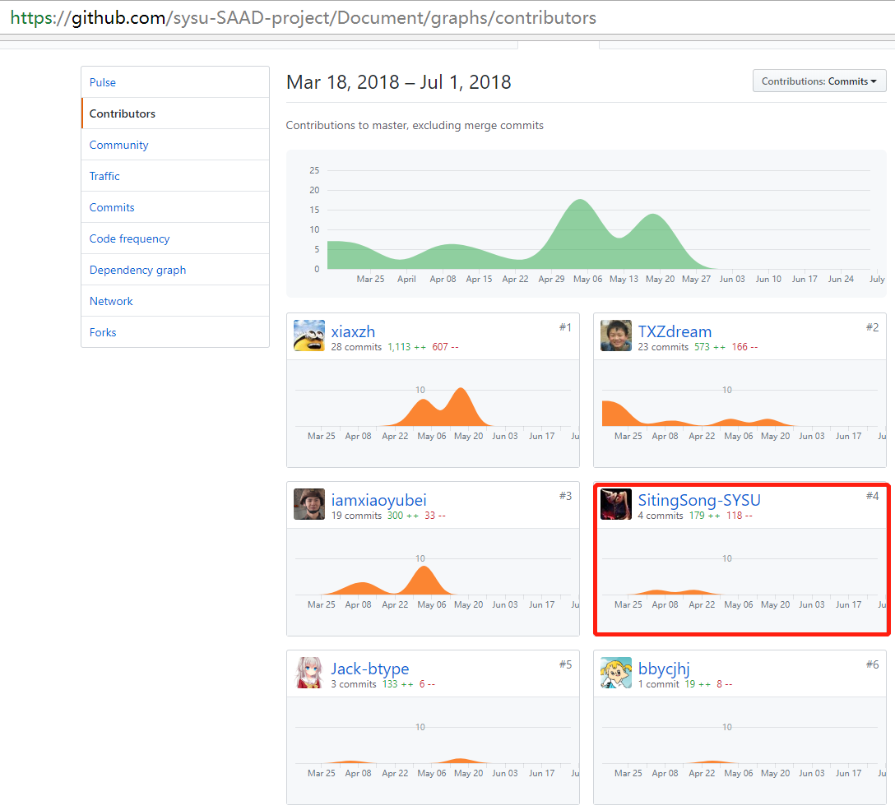

# 自我总结

## 总结

本次课程设计中，我扮演了前端开发工程师的角色。
经过历时大半学期的四次迭代，我受益匪浅：
1. 对前端小程序开发进行简单的学习使用，期间针对官方修改api的问题进行代码调整
2. 使用eslint对本地代码风格静态检查及远程部署到github上
3. 对项目代码分模块迭代开发及人员分工上有了初步认识
4. 对整体项目开发流程有了初步认识

## PSP2.1统计表
| PSP2.1         | Personal Software Process Stages | Time (%) | document |
| --------       |           -----:                 | :----:   |  :----:   |
|**Planning**    |   **计划**                       |   10     |   1      |
|Estimate        |   估计这个任务需要多少时间         |   10     |   1      |
|**Development** |   **开发**                       |   80     |   4      |
|Analysis        |   需求分析 (包括学习新技术)        |   5     |   1       |
|Design Spec     |   生成设计文档                    |   5     |   2       |
|Design Review   |   设计复审 (和同事审核设计文档)    |   5      |   0      |
|Coding Standard |   代码规范 (为目前的开发制定合适的规范)|   15   |   1    |
|Design          |   具体设计                        |   10     |   0     |
|Coding          |   具体编码                        |   25      |   0     |
|Code Review     |   代码复审                        |   10      |   0    |
|Test            |   测试（自我测试，修改代码，提交修改）|   5    |   0      |
|**Reporting**   |   **报告**                       |   10      |   2     |
|Test Report     |   测试报告                        |   0      |   0      |
|Size Measurement|   计算工作量                      |   0      |   0      |
|Postmortem & Process Improvement Plan|事后总结, 并提出过程改进计划| 10 | 2 |
|**Summary**     |   **合计**                       |   100     |   7    |

## 个人分支的 GIT 统计报告

前端代码部分

文档部分

## 自己做的最具价值的工作
1. 负责前端小程序整体开发流程及任务分工
2. 负责静态检查及远程部署

## 博客清单
[前端eslint检查 + travis持续集成](https://blog.csdn.net/sst2230879/article/details/79922204)

