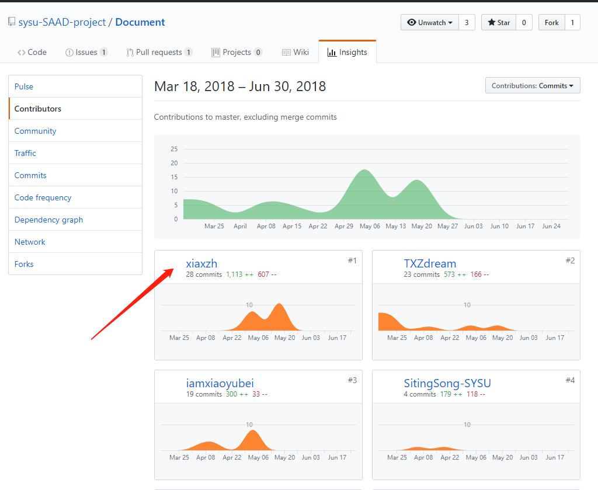
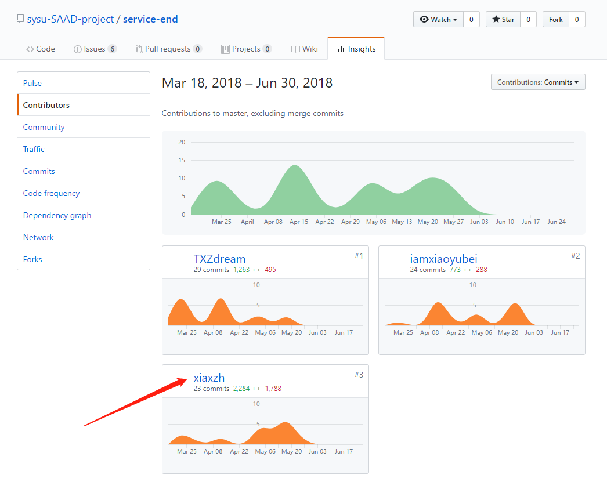

# ActivityPlus-Sysu final report

1. 自我总结

    在课程作业的整个开发过程中，我参与了我们系统后台开发和运维的工作。特别谢谢我的组长玄昭和组员雨蓓，玄昭和我一起承担了运维工作，一起编写docker-compose，将系统部署到服务器上。雨蓓则是负责设计第二次迭代的后台技术架构，也在后续的迭代中提供了帮助。在整个开发的过程中，我贡献了不少的代码和花费了不少的时间。由于缺少实战经验，在开发的过程中反复修改导致组员们工作量增加，所幸大家相互之间宽容谅解，开发工作按时完成。整个开发过程我们采用RUP的开发模式，四次迭代任务明确，完成效率高。在后两次迭代中，参与技术设计让我更加深刻地对前后端工作分离和系统解耦可拓展有了更深刻的理解。

2. GIT总结报告

    - Document's contribution:
    
    

    - Server's contribution:

    

3. 自认为最有意义的工作

    最有意义的工作莫过于负责迭代3、4的后台设计

    迭代3的[技术说明文档](https://github.com/sysu-SAAD-project/Document/blob/master/iter-3/%E6%8A%80%E6%9C%AF%E8%AF%B4%E6%98%8E%E6%96%87%E6%A1%A3.md)

    迭代4的[技术说明文档](https://github.com/sysu-SAAD-project/Document/blob/master/iter-4/%E6%8A%80%E6%9C%AF%E8%AF%B4%E6%98%8E%E6%96%87%E6%A1%A3.md)

4. 博客清单

    [Docker从入门到实战（转存）](https://www.kancloud.cn/maozhenggang/docker-api/94196)
