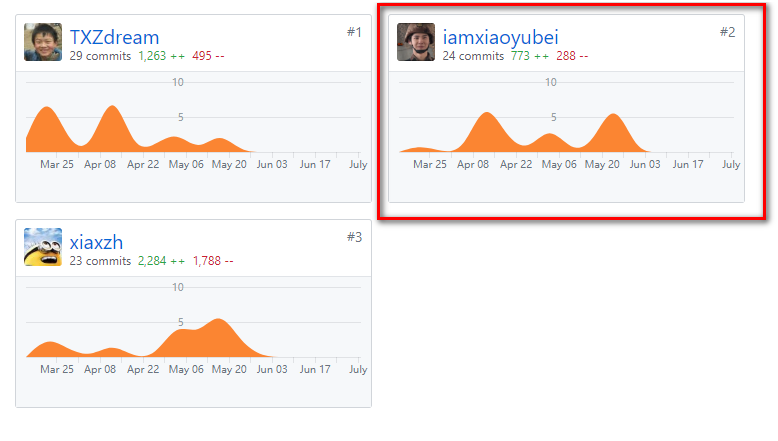
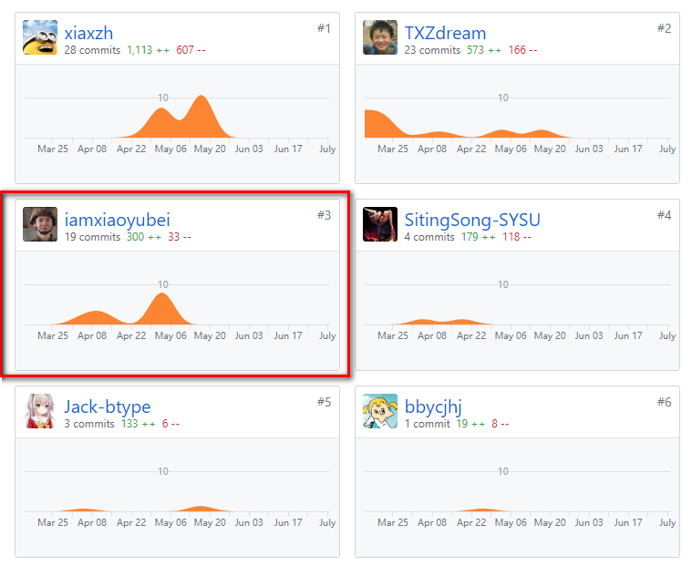

# 15331324_课程学习自我总结
## 简短的自我总结（400字以内）

这一次课程项目中，我主要负责了系统架构的设计和后端代码的编写工作。
在每一次迭代中，与组员们一起讨论，分析需求，在需求部分，我主要贡献是《项目前期调研文档》；在确定需求后，我们每次迭代分配部分人进行架构设计，我主要和组长一起完成了第一二次设计，以及之后和xxz一起完成了第三次架构设计；在设计中，主要工作为API设计和部分数据库设计和部分技术文档编写；同时还完成了部分分析设计相关的图表在pic中；在开发中，主要完成第二三四次迭代的部分后端代码：登陆模块（其中利用微信小程序API以及生成token），获取报名活动列表模块和日志模块。
在这个过程中也学习到了迭代开发的各种过程和相关制品，还有了解到了许多设计模式，受益匪浅。
最后，十分十分感谢 @TXZdream 组长的耐心地指导和包容以及对我们小组的付出，也十分感谢 @xiaxzh 帮我解决了一些bug，同时也十分感谢小组的其他成员的配合和付出~

## PSP 2.1 统计表
| PSP2.1         | Personal Software Process Stages | Time  |
| --------       |           -----:                 | :----:   | 
|**Planning**    |   **计划**                       |   1week     | 
|Estimate        |   估计这个任务需要2month        |   1week    | 
|**Development** |   **开发**                       |   8weeks(2weeks/iter)    |
|Analysis        |   需求分析 (包括学习新技术)        |  2 iter, 2 days per iter    |
|Design Spec     |   生成设计文档                    |   2 iter, 3 days per iter    |  
|Design Review   |   设计复审 (和同事审核设计文档)    |   2 iter, 1 day per iter   | 
|Coding Standard |   代码规范 (为目前的开发制定合适的规范)|   3 days | 
|Design          |   具体设计                        |   each iter, 2 days per iter    | 
|Coding          |   具体编码                        |   each iter, 3 days per iter   | 
|Code Review     |   代码复审                        | each iter, 1 days per iter  | 
|Test            |   测试（自我测试，修改代码，提交修改）|  each iter, 2 days per iter   | 
|**Reporting**   |   **报告**                       |   4days     |
|Test Report     |   测试报告                        |   0      | 
|Size Measurement|   计算工作量                      |   2 days    | 
|Postmortem & Process Improvement Plan|事后总结, 并提出过程改进计划| 2days |
|**Summary**     |   **合计**                       |   9weeks and 4days    |

## 个人分支的 GIT 统计报告（不需要解释原因）- 仅需要提交截图
后端代码部分：

API设计，设计文档等等文档部分：

## 自认为最得意/或有价值/或有苦劳的工作清单，含简短说明（一句话）
架构设计（主要API和数据库设计）和后端代码开发

## 个人的技术类、项目管理类博客清单（只需要名称与 url ）
[build-web-application-with-golang学习笔记](https://www.cnblogs.com/iamxiaoyubei/p/8850344.html)