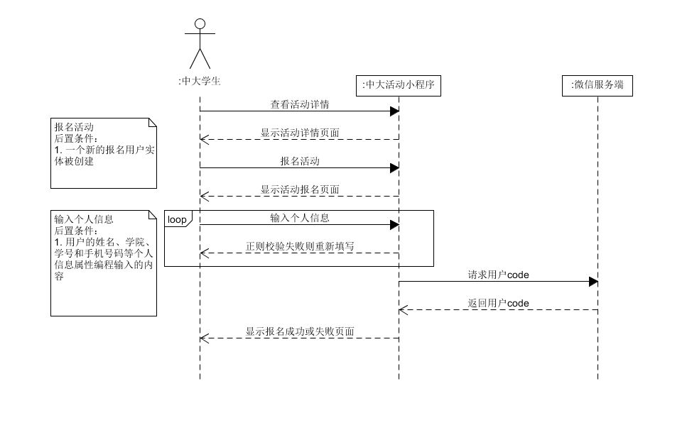

#  SYSU Activity+ Team

* 1、[项目规划](01_About.md)

* 2、[团队组建](02_Team_Profile.md)

* 3、[项目前期调研](03_Investigation.md)

* 4、[项目愿景](04_Vision.md)

* 5、[产品特性](05_Product_Backlog.md)

* 6、需求规格说明

    - 6.1 [Usecase Diagram](10_Usecase_Diagram.md)

    - 6.2 Use Cases

    - 6.3 Domain Model
        - 15331322(报名)
        
        

    - 6.4 State Model

    - 6.5 System Sequence Diagram
        - 15331288(登录场景)
        
        
        
        - 15331322(登录场景)
        
        

        - 15331309(报名场景)
        
        
        
        - 15331287(报名场景）
        
        

        - 15331323(讨论区场景)
       
        

        - 15331289(浏览活动场景)
        
        

* 7、设计
    - 7.1 UI Design
        - [浏览活动用例UI设计](09_UI-Design_for_some_usecases.md)

    - 7.2 Database design
        - [数据库设计](13_DB_Design_for_System.md)

    - 7.3 API
        见master分支的api blueprint文件

    - 7.4 软件架构文档
        - [软件架构文档](14_Architure.md)

    - 7.5 用例设计(TODO: all)
        
        - 7.5.1 报名活动用例设计
            
            - [报名活动用例设计](15_活动报名用例.md)

        - 7.5.2 浏览活动用例设计

            - [浏览活动用例设计](16_浏览活动用例.md)

* 8、[生产规范与指南](08_规范.md)

* 9、会议记录

    - 9.1 [Inception meeting(2018/3/9)](06_Inception_meeting-20180309.md)

    - 9.2 [第一次迭代总结会议(2018/4/1)](07_Iter-1_Meeting-20180401.md)

    - 9.3 [第一次迭代总结会议(2018/4/22)](12_Iter-2_Meeting-20180422.md)

## 建模练习

- [美团酒店预订_建模练习](11_MeiTuan_ReserveHotel_Documentation_Practice.md)
- 已提交的内容及点评(TODO: wzj)
1.建模者1
- [建模者答案与评价](https://shimo.im/docs/5rN4PgT4PD4Dwony/)

## 技术报告(TODO: all)

  - [txzdream 15331288](https://txzdream.github.io/2018/04/15/SAAD-summary-iter1/)
  - [技术博客_sst_14970011](https://blog.csdn.net/sst2230879/article/details/79922204)
  - [xiaxzh 15331322](https://xiaxzh.github.io/2018/04/15/iter-1-summary)

## 期末报告

1. 自我总结(TODO: all)

  - [txz_15331288](https://txzdream.github.io/2018/07/01/SAAD-CONCLUSION/)
  - [sst_14970011](https://github.com/sysu-SAAD-project/Document/blob/gh-pages/Summary_sst_14970011.md)
  - [tzh](https://bbycjhj.github.io/系统分析设计/2018/06/30/系统分析与设计-finial-report.html)
  - [wzj](https://starthemoon.github.io/blog/系统分析与设计之期末报告/)
  - [xxzh](./Summary_xiaxzh_15331322.md)

2. 统计表(贡献见[成员清单部分](02_Team_Profile.md))

3. git提交情况

  - [document contribution](https://github.com/sysu-SAAD-project/Document/blob/gh-pages/contributions/document%20contributions.png)
  - [front-end contribution](https://github.com/sysu-SAAD-project/Document/blob/gh-pages/contributions/front-end%20contributions.png)
  - [service-end contribution](https://github.com/sysu-SAAD-project/Document/blob/gh-pages/contributions/service-end%20contributions.png)
  - [script contribution](https://github.com/sysu-SAAD-project/Document/blob/gh-pages/contributions/script%20contributions.png)

4. [项目部署文档](https://github.com/SYSU-ActivityPlusPC/document/blob/master/01_%E5%AE%89%E8%A3%85%E9%83%A8%E7%BD%B2%E8%AF%B4%E6%98%8E.md)
