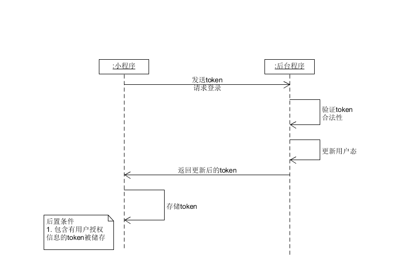

# SYSU Activity+ Team

## [项目规划](01_About.md)

## [团队组建](02_Team_Profile.md)

## [项目前期调研](03_Investigation.md)

## [项目愿景](04_Vision.md)

## [产品特性](05_Product_Backlog.md)

## 需求规格说明

### [Usecase Diagram](10_Usecase_Diagram.md)

### Use Cases

### Domain Model

- 15331322(报名)

    
### State Model

### System Sequence Diagram

- 15331288(登录场景)

    

- 15331322(登录场景)

    

- 15331309(报名场景)

    

- 15331323(讨论区场景)

  

- 15331289(浏览活动场景)

    
## 设计

1. UI Design

    - [XX用例UI设计](09_UI-Design_for_some_usecases.md)

2. Database design

3. API

    见master分支的api blueprint文件

## [生产规范与指南](08_规范.md)

## 会议记录

- [Inception meeting(2018/3/9)](06_Inception_meeting-20180309.md)
- [第一次迭代总结会议(2018/4/1)](07_Iter-1_Meeting-20180401.md)
- [第一次迭代总结会议(2018/4/22)](12_Iter-2_Meeting-20180422.md)

## 建模练习
- [美团酒店预订_建模练习](11_MeiTuan_ReserveHotel_Documentation_Practice.md)
