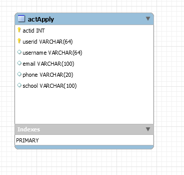

# 软件技术说明文档

## 接口参数说明

## Activity Collection [/act]

## Activity Apply Collection [/actApply]

### User sign up certain activity [POST /actApply/{actId}]

#### Request

- actid
  报名的活动id

- userid
  报名的用户id

- username
  报名时填写的用户名

- email
  报名时填写的邮箱
                
- phone
  报名时填写的联系方式

#### Response
- 200
  报名填写成功

- 400
  出现错误

### User get registration list [GET /actApply?user={userId}]

#### Request

- userId

  按照需求文档说明，这个参数指定了获取用户的报名活动列表的该用户id

#### Response 

- 200 (application/json)
  -  content   json数组，用以存储后台根据userId查询到的所有报名列表及相关信息，以下为具体字段内容
    
      - actid
      报名的活动id
    
      - username
      报名时填写的用户名
    
      - email
      报名时填写的邮箱
                    
      - phone
      报名时填写的联系方式

- 400
  出现错误  

## 数据库表头说明

- userid
  报名的用户id

- actid
  报名的活动id

- username
  报名时填写的用户名

- email
  报名时填写的邮箱
                
- phone
  报名时填写的联系方式