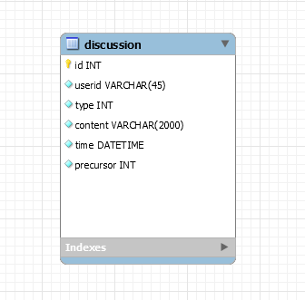

# 技术说明文档

## Acitivity Discussion Collection [/discus]

### User get newly discussion lists [GET /discus?page={pageNum}&type={typeNum}]

#### Request

- pageNum

  - 默认每页最多为10个活动。
    例如：当前段进入活动列表页面时，此时需要第一页的数据，而当前段上拉倒需要加载下一页时，则需要向后端发出pageNum为2的请求

- typeNum

  - typeNum指定获取的帖子的类型，若要获取类型为组队的帖子，则设置type为2。其余分别为评论[1]，问答[4]和分享[8]

- HEADERS

  - Authorization: token_string

- BODY

  - empty

#### Response

- 200 (application/json)

  - 待定

  ```
  "contnent": [
      {
          "id" : 28,
          "userid" : "oXRoe0c7KDoAVGKOTYks_kaV2iQA",
          "type" : 1,
          "content" : "这是一条评论",
          "time" : 1521820800000,
          "precursor" : 2
      }
  ]
  ```

- 401
  用户未登陆(不含有token)或用户token错误或超时，或该用户token对应用户id不存在，需要重新登陆

- 500
  服务器错误

### User sign up certain discusstion [POST /discus]

#### Request

- HEADERS

  - Authorization: token_string

- BODY

  - type
    帖子类型 --- type(INT)

  - content
    帖子内容 --- type(STRING)

  - time
    帖子发布时间 --- type(DATETIME) ? **待确定**

  - precusor
    帖子前驱 --- type(INT)

#### Response

- 200
  帖子发布成功

- 400
  bad request，请求语义有误

- 401
  用户未登陆(不含有token)或用户token错误或超时，或该用户token对应的用户id不存在，需要重新登陆

- 500
  服务器错误

## 数据库表头及说明



- id
  帖子的自增id，作为主键约束区分每个帖子

- userid
  发布帖子的用户openid

- type
  帖子类型--评论[1]、组队[2]、问答[4]和分享[8]

- content
  帖子内容，支持长度在2000以内的字符内容(暂不支持图文)

- time
  帖子发布时间--绝对时间

- precursor
  帖子前驱，用作寻找评论对象--若类型为评论，设为评论对象的id，若类型为非评论，设为-1